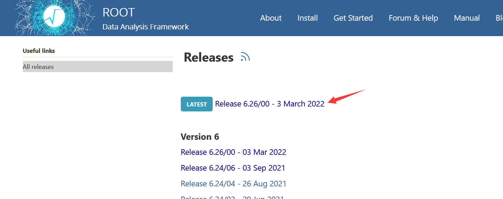
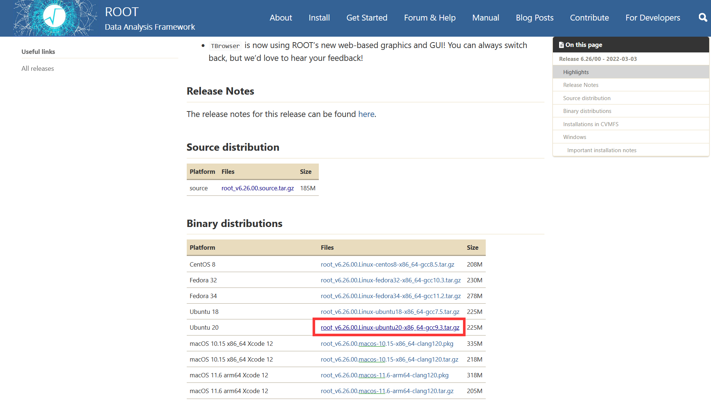
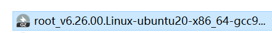
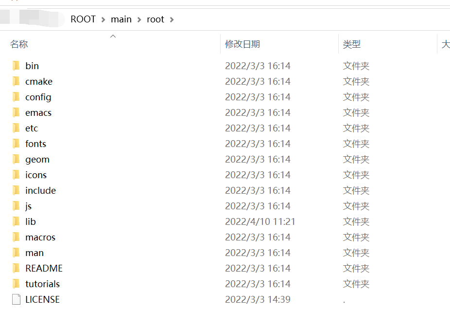
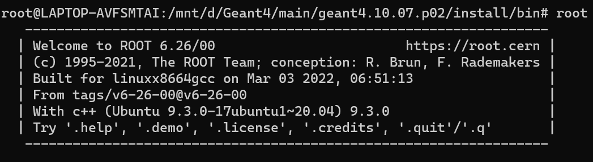

---

**创建时间**：2022年4月10日10:35:24
**最新更新**：2022年4月10日11:37:31

---

**Problem Description**：WSL2 installation and configuration ROOT

**核心思路**：
* 装依赖
* 下二进制文件
* `source`一下，当然也可以写入bash
	* 我的多个`source .sh`的操作会冲突，骚操作见[WSL，WSL2多个想source的环境变量，如何在.bashrc内基于if-else进而在bash内可交互式进行选择？而不用每次使用复杂指令](./54e1736e.html)

---

**环境**：
* Windows 10 21H2（已实现GPU穿透，GPU穿透见[[WSL2实现GPU穿透]]
* Ubuntu 20.04 on Windows （WSL2）

---

# 依赖
* 装依赖，在对应`Bash`内输入

```bash
# 必选
sudo apt install dpkg-dev cmake g++ gcc binutils libx11-dev libxpm-dev libxft-dev libxext-dev python openssl libssl-dev
# 可选（也都装上）
sudo apt install gfortran libpcre3-dev xlibmesa-glu-dev libglew1.5-dev libftgl-dev
 default-libmysqlclient-dev libfftw3-dev libcfitsio-dev graphviz-dev libavahi-compat-libdnssd-dev libldap2-dev python-dev libxml2-dev libkrb5-dev libgsl0-dev libqt4-dev
# 后来发现需要装的
sudo apt install mpi-default-dev
```

# 下文件
* 去[ROOT官网Releases页面](https://root.cern/install/all_releases/)，下你喜欢的版本，我是下最新版，下面箭头指的是最新版对应的页面
	* 
* 下`Binary distributions`文件，我对应的是`Ubuntu 20.04`
	* 当然你也可以搞到下载链接以后用`wegt`，比如我这个对应的是`wget https://root.cern/download/root_v6.26.00.Linux-ubuntu20-x86_64-gcc9.3.tar.gz`
		* `wegt`记得要进入你要下载的文件夹后再用~
	* 
* 解压，你可以在对应目录下用`tar -xzvf`，比如我这个是进入对应路径后`tar -xzvf root_v6.26.00.Linux-ubuntu20-x86_64-gcc9.3.tar.gz`，也可以手动解压，解压完移入对应的文件夹即可，安装就完成了
	* 
	* 


# 启用它！
* 打开`WSL`对应的`bash`，输入`source`+` 你的路径/root/bin/thisroot.sh` ，比如我的是`source /mnt/d/ROOT/main/root/bin/thisroot.sh`
* 然后输入`root`启用，成功如下图
	* 

# 其他
* 多个`source .sh`的操作会冲突，骚操作见[WSL，WSL2多个想source的环境变量，如何在.bashrc内基于if-else进而在bash内可交互式进行选择？而不用每次使用复杂指令](./54e1736e.html)
* ROOT+WSL2的可视化，见
	* [[可视化使用ROOT简要办法]]
	* [[ROOT + XMing配置Multiple windows方案，XMing使用One large window无法便捷操作ROOT窗口]]
		* 注意下面这个教程，最好先完成[WSL2实现GPU穿透](./808f0e36.html)


# Ref
* [【ROOT】Win10-WSL安装CERN ROOT (roo6)](<https://taoyi92.github.io/tutorial/%E3%80%90ROOT%E3%80%91Win10-WSL%E5%AE%89%E8%A3%85CERN%20ROOT%20(root6)/>)
* [基于 WSL2 的 Geant4 和 ROOT 安装教程](https://zhuanlan.zhihu.com/p/374051825)
