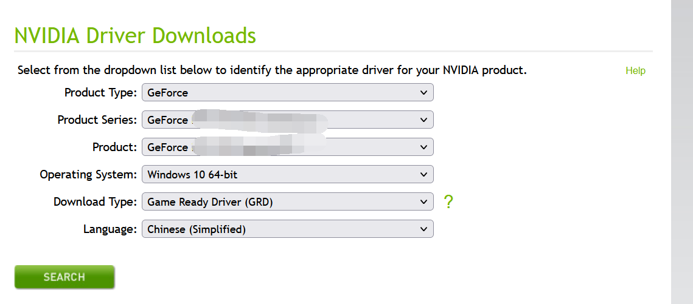
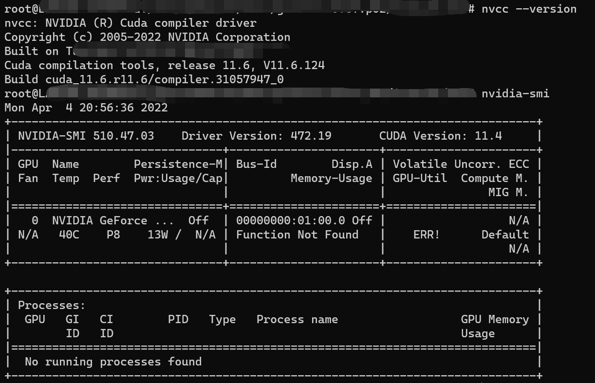

---

**创建时间**：2022年4月4日17:05:43
**最新更新**：2022年4月4日20:58:53

---

**核心思路**：升到Win10 21H2，按英伟达官方教程配置

---
# 升Win10 21H2
* 用[MediaCreationTool21H1](https://go.microsoft.com/fwlink/?LinkId=691209)升级系统

# 下驱动
* 到英伟达官网，下载[Windows系统下面向WSL的CUDA驱动](https://www.nvidia.com/Download/index.aspx?lang=en-us)
	* 按你的需求搜索，如下图
	

# 升WSL2
* 升级WSL到WSL2，打开`Windows PowerShell`，输入如下代码

```bash
wsl --set-version Ubuntu-20.04 2
```
* 具体见[总结Windows下安装WSL与升级WSL2的方法](https://blog.csdn.net/qq_35333978/article/details/113177819)


# 配置
* 在容器内安装CUDA，注意容器内不需要安装驱动 [英伟达手册](https://docs.nvidia.com/cuda/wsl-user-guide/index.html#installing-nvidia-drivers)。从`4.2.6 Building Your Own GPU-accelerated Application on WSL 2` 开始，到`5. WSL 2 System Requirements`之前结束，`4.2.7`按个人需求，可以不执行

* 添加环境变量，打开`WSL2`的`Bash`，输入`vim ~/.bashrc`，写入
```
export CUDA_HOME=/usr/local/cuda
export LD_LIBRARY_PATH=${CUDA_HOME}/lib64
export PATH=${CUDA_HOME}/bin:${PATH}
```
* 保存后退出，在`Bash`内输入`source ~/.bashrc`

# 配置完成
* 在`WSL2`的`Bash`内输入
	* `nvcc --version`
	* `nvidia-smi`
* 配置成功后效果如下图



# Ref
* [WIN10配置WSL2调用GPU](https://mirror.xyz/0xc7122a0950FF5CA3C8Ed07AD8FD9dcB1fcd47f12/taYtWWoW64EqcUnAvcPcVQU5PJ80jQ3y08fWMEcWfeA)
* [Windows10 21H2 更新问题](https://answers.microsoft.com/zh-hans/windows/forum/all/windows10-21h2/e2ba8494-fd67-4357-a4b8-47f9d7880606)
