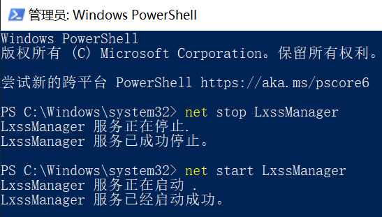

---

**创建时间**：2022年3月23日10:06:51
**最新更新**：2022年3月23日10:07:24

---

**核心思路**：WSL基于`LxssManager`服务进行，因此开关该服务即可

---

* 关闭与启动WSL，都需要以管理员模式打开`Windows Powershell`，WSL基于`LxssManager`服务进行，因此开关该服务即可
  * 输入`net stop LxssManager`，停止`LxssManager`服务，从而停止WSL
  * 输入`net start LxssManager`，开启`LxssManager`服务，从而启动WSL

