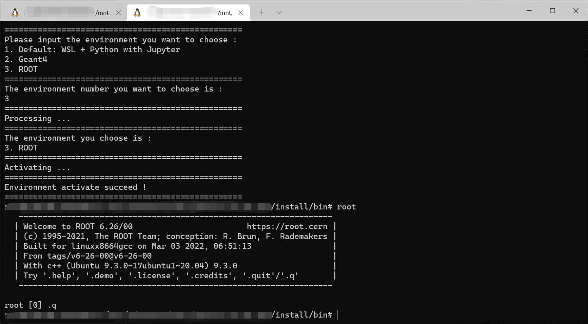

---

**创建时间**：2022年4月10日10:11:38
**最新更新**：2022年4月10日11:43:55

---

**Problem Description**：WSL, WSL2 has multiple environment variables that you want to source, how to interactively select them based on if-else in .bashrc and then in bash? instead of using complex instructions every time

**核心思路**：
* `.bashrc`的`read`读数据
* `.bashrc`的`echo`打印内容
* `.bashrc`的`if-else`语句进行判断

---

# 配置
* 打开`.bashrc`，我用`Notepad++`直接开的
	* `\\wsl$\Ubuntu-20.04\root\.bashrc`约莫在这个路径

* 在`.bashrc`最下方添加如下代码，保存，然后打开一个新的`bash`就好啦
	* 基于`if-else`实现，就是按对应序号选
	* `read envType`接受变量输入
	* `echo`相当于`Python`的`print`
	* 需要替换的部分
		* `改成你自己的Geant4安装路径，记得有mnt`这个部分记得替换成你自己的`Geant4`安装路径
		* `改成你自己的ROOT安装路径，记得有mnt`这个部分记得替换成你自己的`ROOT`安装路径

```bash
# 选择你需要的环境变量
echo "=================================================="
echo "Please input the environment you want to choose :"
echo "1. Default: WSL + Python with Jupyter"
echo "2. Geant4"
echo "3. ROOT"
echo "=================================================="
echo "The environment number you want to choose is :"
read envType

echo "=================================================="
echo "Processing ..."
echo "=================================================="
echo "The environment you choose is :"
if ((envType == 1)); then   
  echo "1. default: WSL + Python with Jupyter"

elif ((envType == 2)); then
  echo "2. Geant4"
  source 改成你自己的Geant4安装路径，记得有mnt/install/bin/geant4.sh
  echo "The path is : 改成你自己的Geant4安装路径，记得有mnt/install/bin/geant4.sh"
elif ((envType == 3)); then
  echo "3. ROOT"
  source 改成你自己的ROOT安装路径，记得有mnt/bin/thisroot.sh
  echo "The path is : 改成你自己的ROOT安装路径，记得有mnt/bin/thisroot.sh"
else   
  echo "Type Error !"
fi

echo "=================================================="
echo "Activating ..."
echo "=================================================="
echo "Environment activate succeed !"
echo "=================================================="
```

# 效果
* 如下图，很爽现在
	* 

# Ref
* [Checking if an input number is an integer](https://unix.stackexchange.com/questions/151654/checking-if-an-input-number-is-an-integer)
* [Bash: If, Else If, Else Examples](https://linuxhint.com/bash_if_else_examples/)
