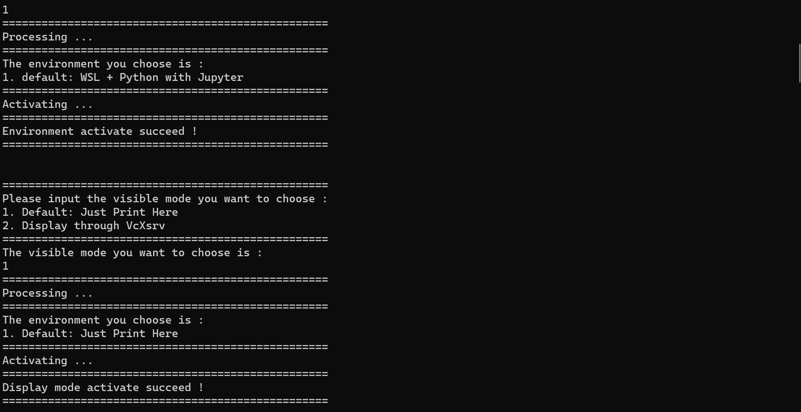

---

**创建时间**：2022年4月11日09:23:44
**最新更新**：2022年4月11日10:00:47

---

**Problem Description**：How does WSL and WSL2 realize that as soon as bash is opened, it is possible to interactively choose whether to visualize or not visualize the configuration through VcXsrv?

**核心思路**：参考[WSL，WSL2多个想source的环境变量，如何在.bashrc内基于if-else进而在bash内可交互式进行选择？而不用每次使用复杂指令](./54e1736e.html)
* `if-else`判选+`read`获取值+`echo`打印

---

# 可视化配置
* 用代码编辑器，如`Notepad++`打开`\\wsl$\Ubuntu-20.04\root\.bashrc`，在最下方添加以下内容

```bash
# 可视化
echo ""
echo ""
echo "=================================================="
echo "Please input the visible mode you want to choose :"
echo "1. Default: Just Print Here"
echo "2. Display through VcXsrv"
echo "=================================================="
echo "The visible mode you want to choose is :"
read visType

echo "=================================================="
echo "Processing ..."
echo "=================================================="
echo "The environment you choose is :"
if ((visType == 1)); then   
  echo "1. Default: Just Print Here"

elif ((visType == 2)); then
  echo "2. Display through VcXsrv"
  export DISPLAY=`cat /etc/resolv.conf | grep nameserver | awk '{print $2}'`:0 # 这是WSL2的可视化配置
  
else   
  echo "Type Error !"
fi

echo "=================================================="
echo "Activating ..."
echo "=================================================="
echo "Display mode activate succeed !"
echo "=================================================="
echo ""
echo ""
```

# 效果
* 如下图
	* 
