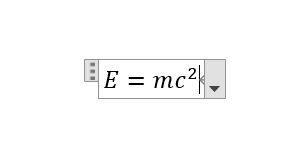
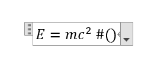
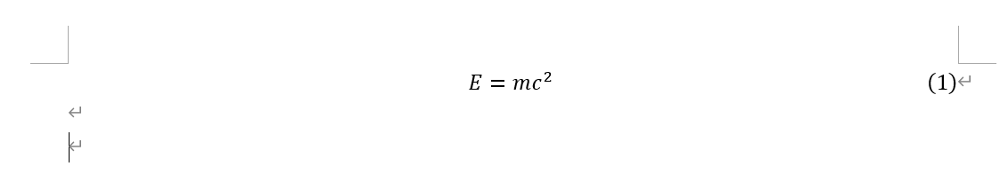

---

**创建时间**：2022年4月9日17:19:43
**最新更新**：2022年4月9日18:48:43

---

**Problem Description**：How does Word implement the serial number inserted into the formula?

**核心思路**：敲完公式，打个空格，输入`#()`，按回车

---

**备注**：Word内添加公式快捷键：<kbd>Alt</kbd>+<kbd>=</kbd>

---

# 序号形成
* 先敲入你的公式，以`E=mc²`为例




* 打个空格，输入`#()`，按回车



* 在对应位置输入序号即可




# 具体输入
* Word内，公式具体输入如下，即可形成序号
```word
E=mc^2 #(1)
```

# Ref
* [Word多行公式的换行、对齐与编号](https://zhuanlan.zhihu.com/p/439988361)
