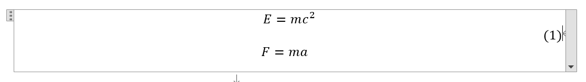

---

**创建时间**：2022年4月9日17:20:38
**最新更新**：2022年4月9日19:46:56

---

**Problem Description**：Word implements multi-line insertion of formulas, using the same formula serial number

**核心思路**：继上一步操作继续，中间加个空行上序号

---

* 前面操作见[Word实现插入多行LaTeX公式，有没有便捷的方法？](./cb2e0f17.html)

# 序号添加
* 中间加一个空行（通过<kbd>Shift</kbd>+<kbd>Enter</kbd>添加），输入序号`#()`，此处输入的是`#(1)`，得到下下图，自动对齐，这是一整块公式块，如下下下图
* 
* 
* 

# word输入内容
```word
E=mc^2
 #(1)
 F=ma
```

# Ref
* [Word多行公式的换行、对齐与编号](https://zhuanlan.zhihu.com/p/439988361)
