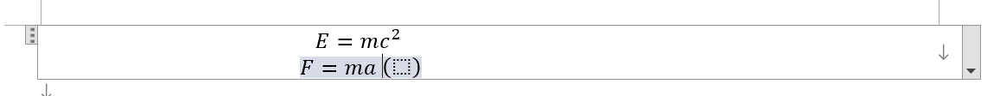

---

**创建时间**：2022年4月9日17:20:08
**最新更新**：2022年4月9日19:44:09

---

**Problem Description**：Word implements inserting multi-line LaTeX formulas, is there a convenient way?

**核心思路**：和`MathPix`联用，<kbd>Shift</kbd>+<kbd>Enter</kbd>

---

# MathPix识别，导出为.docx
* 先OCR，`Export .docx`
  * 
  * 

# .docx里头变成同一个公式快
* 打开这个`.docx`，这是2行公式块
  * 

* 在第一行公式块后输入` #()`（注意有一个空格），然后回车
	* 这一步目的是为了拓展公式块宽度，同时也是多行公式的准备
	  * 
* 光标移到`(`前，按<kbd>Shift</kbd>+<kbd>Enter</kbd>，粘贴第二行的公式，如下下图，删除最后面的`#()`，得到多行公式块如下下下图
  * 
  * 
  * 

# Ref
* [Word多行公式的换行、对齐与编号](https://zhuanlan.zhihu.com/p/439988361)
