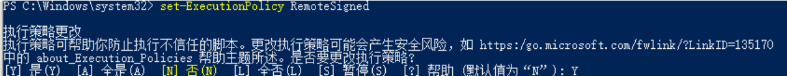

---

**创建时间**：2022年3月29日20:15:45
**最新更新**：2022年3月29日20:15:50


---

* 以管理员身份打开`Windows Powershell`，输入如下指令→输入`Y`→按回车

```PowerShell
set-ExecutionPolicy RemoteSigned
```



# Ref
* [npm无法在powershell运行](https://blog.csdn.net/only_neo/article/details/116979393?utm_medium=distribute.pc_aggpage_search_result.none-task-blog-2~aggregatepage~first_rank_ecpm_v1~rank_v31_ecpm-1-116979393.pc_agg_new_rank&utm_term=npm+powershell+%E5%AE%89%E8%A3%85&spm=1000.2123.3001.4430)
