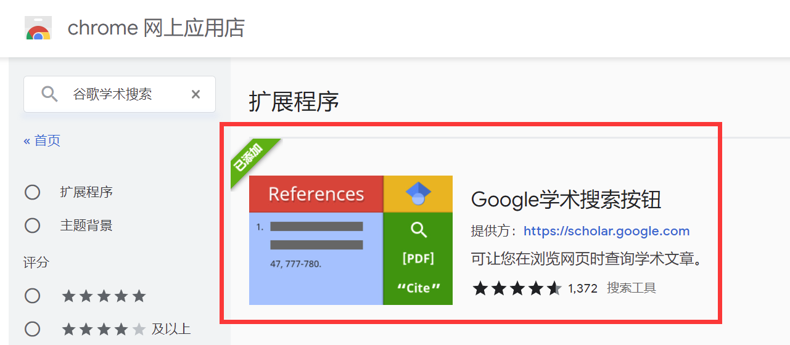
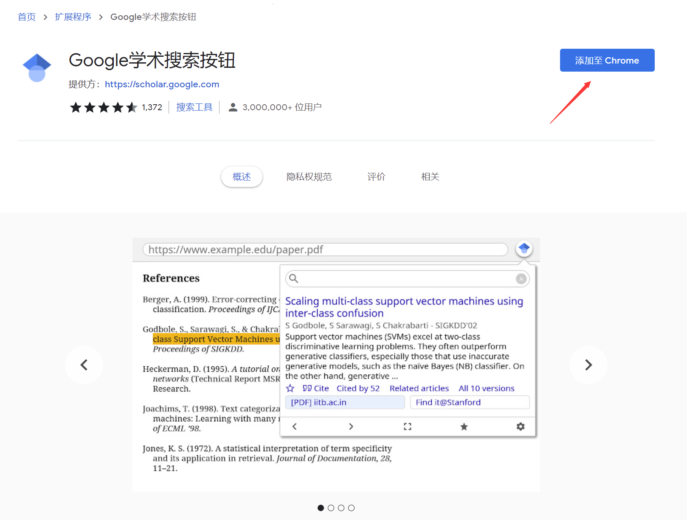
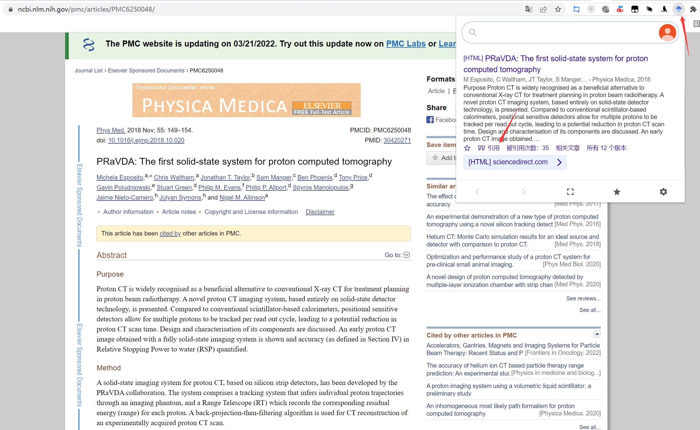
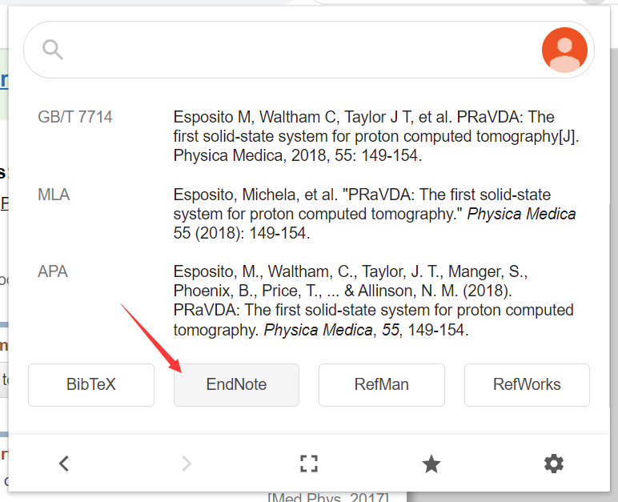
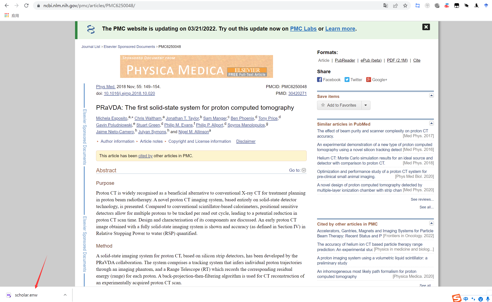
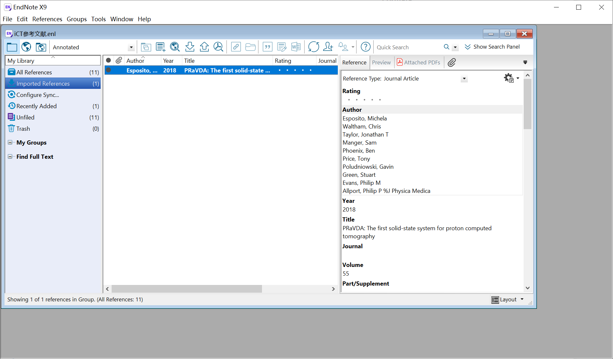

---

**核心思路**：Google学术搜索按钮插件

---

# 插件部署
* 在Chrome商店or对应浏览器商店（FireFox也支持）安装`Google学术搜索按钮`

* 固定到拓展程序栏

# 使用

* 打开论文页面→点击插件→`引用`→对应软件的下载项，如`EndNote`→下载到想要的文件夹→点击该文件（`EndNote`是`.enw`文件）打开→导入到`EndNote`里（注意`EndNote`要提前启动）

