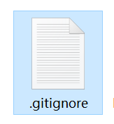
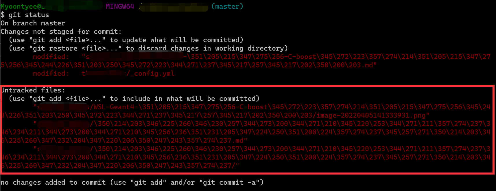

---

**创建时间**：2022年4月6日21:09:05
**最新更新**：2022年4月6日23:16:59

---

**Problem Description**：How should I set some folders that I don't want to push to GitHub?

**核心思路**：`git touch .gitignore`后，在`.gitignore`里写规则

---

# .gitignore创建与配置
* 打开`Git-Bash`，进入对应文件夹的根目录，输入以下指令`git touch .gitignore`，在当前目录创建一个新的`.gitignore`文件
	* 文件夹根目录，指的是`.git`文件夹所在目录，这是个隐藏文件夹
	* 比如你的`.git`在`E:\Code`文件夹下，那么你在`Git-Bash`里进到这个目录以后，你再`git touch .gitignore` 



* 双击打开`.gitignore`，编写你需要采纳的规则，包括不要push的文件夹、文件类型，例外的文件夹、文件，写完后保存，下面是一个示例

```text
// 忽略这个文件夹，即这个文件夹下所有东西不push
Folder_ignore/**


// 忽略非代码
*.csv
*.xlsx
*.root
*.zip
*.7z
*.png
*.jpg

// 不忽略Folder_ignore文件夹下的.png文件
!Folder_ignore/*.png
```

## 将文件添加到Git配置
* 如果你不是通过`git touch`创建的`.gitignore`，你可以在`Git-Bash`内进入代码仓路径，然后通过如下语句将`.gitignore`添加到Git配置

```bash
git config --global core.excludesfile ~/.gitignore
```

# 看配置成了没

* 打开`Git-Bash`，进入这个文件夹，输入`git status`，在`Untracked files`可以看到你配置是否生效，下图是以另一个代码仓为例，单纯为了表示大概在这个位置



# push上去
* 成功了之后，`git add .`，`git commit -m`打注释，`git tag`打标签，`git push`传上去

# Ref
* [如何使用.gitignore忽略Git中的文件和目录](https://www.myfreax.com/gitignore-ignoring-files-in-git/)
* [git忽略某个目录或文件不上传](https://blog.csdn.net/sunxiaoju/article/details/86495234)
