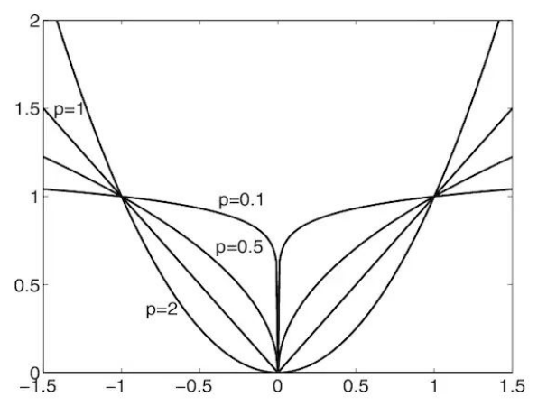
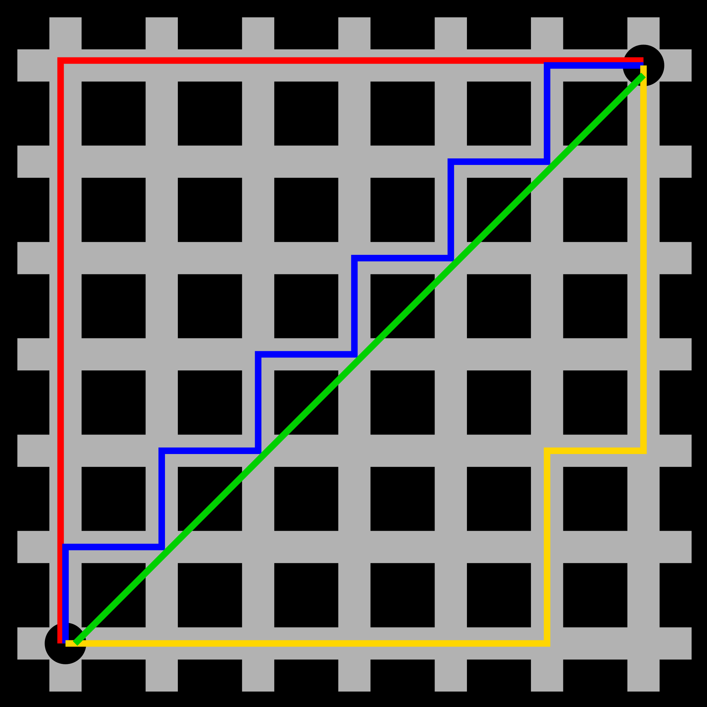
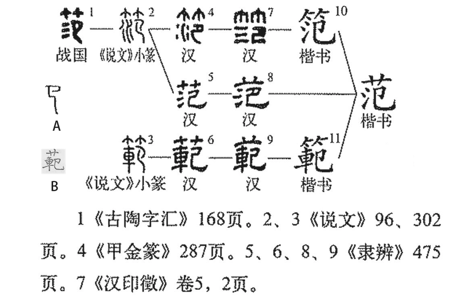

---

**创建时间**：2022年4月5日21:17:28
**最新更新**：2022年4月8日11:09:27

---

**Problem Description**：What does norm mean? What is the practical use? Understanding of norm?

**核心思路**：范数就是在求距离，只不过是不同场景里的距离

---

# 背景，是什么？
---

**概念**：
* 范数是对向量（或者矩阵）的度量，是一个标量（scalar）
* 范数是具有“长度“概念的函数
* 在线性代数、泛函分析及相关的数学领域，是一个函数，其为向量空间内所有向量赋予非零的正长度或大小
* 半范数反而可以为非零的向量赋予零长度

---

**简单来说**：
* 范数就是算距离的，不同场景下的距离
* 范数提供了比较向量/矩阵是否“优秀”的一种标准

---

> 范数（英语：Norm），是具有“长度”概念的函数。在线性代数、泛函分析及相关的数学领域，是一个函数，其为向量空间内的所有向量赋予非零的正长度或大小。另一方面，半范数（英语：seminorm）可以为非零的向量赋予零长度。
>
> 举一个简单的例子，一个二维度的欧氏几何空间$ \mathbb{R}^{2} $就有欧氏范数。在这个向量空间的元素（譬如：(3,7)）常常在笛卡尔坐标系统被画成一个从原点出发的箭号。每一个向量的欧氏范数就是箭号的长度。
>
> 拥有范数的向量空间就是赋范向量空间。同样，拥有半范数的向量空间就是赋半范向量空间。 

## 分别是什么？

### 零范数

---

**简单来说**：$ L_{0} $ 范数是指向量中非0的元素的个数

---

> * 矩阵的L0范数就是非0元素的个数，通常用它来表示稀疏，L0范数越小，0元素越多，也就越稀疏。
>
> $$\begin{equation}\label{eq1}
> \| \mathbf{ x } \|_{0} = \lim _{ p \rightarrow 0 } \| \mathbf{ x } \|_{ p }^{ p } = \lim_{ p \rightarrow 0 } \sum_{ k=1 }^{ m}\left| x_{ k }\right|^{ p } = \#\left\{ i: x _{ i } \neq 0 \right\} 
> \end{equation}$$
>
>
> * 如下图所示，p 趋近于0时，函数就只有在$ x=0 $的时候等于0，其他的位置都为1。下图纵轴是元素的取值
> * 也就是说，$ L_{0} $ -Norm可以用于表达一个向量/矩阵的稀疏性，且是非凸函数。
> 

### 一范数

---

**简单来说**：$ L_{1} $就是算城市区块最短距离的，只能走区块四周的街或者路，算他总共有多长

---

> 一范数又称绝对值范数，是在由实数或虚数构成的一维向量空间中的范数。绝对值范数是曼哈顿范数的特殊形式。 

**算法**：

$\begin{equation} \|x\|_{1}=\sum_{i=1}^{N}\left|x_{i}\right|\end{equation}$

**概念**：
* 一范数是向量元素绝对值之和

### 二范数

---
**简单来说**：$ L_{2} $就是通常我们口中的距离，空中直线距离

---

二范数又称欧几里德范数，在n维欧几里德空间 $ \mathbb{R}^{n} $ 上，向量 $ \boldsymbol{x}=\left(x_{1}, x_{2}, \ldots, x_{n}\right)^{\mathrm{T}} $ 的最符合直觉的长度由以下公式给出 
$$\begin{equation} \|\boldsymbol{x}\|_{2} = \sqrt{x_{1}^{2}+\cdots+x_{n}^{2}} \end{equation}$$

### 无穷范数
---
**简单来说**：$ L_{-\infty} $ 是向量的所有元素的绝对值中最小的，$ L_{+\infty} $ 是向量的所有元素的绝对值中最大的

---

**逻辑推导**：

最常用的范数是p-范数，即对 $ x=\left[x_{1}, x_{2}, \cdots, x_{n}\right]^{\mathrm{T}} $ ，有
$$\begin{equation} \|x\|_{p}=\left(\left|x_{1}\right|^{p}+\left|x_{2}\right|^{p}+\cdots+\left|x_{n}\right|^{p}\right)^{\frac{1}{p}} \end{equation}$$

当p取无穷大时，该取值只与其中元素的最大值有关
$$\begin{equation} \|x\| _{+\infty}=\max \left(\left|x_{1}\right|,\left|x_{2}\right|, \ldots,\left|x_{n}\right|\right) \end{equation}$$

当p取无穷小时，该取值只与其中元素的最小值有关
$$\begin{equation} \|x\| _{-\infty}=\min \left(\left|x_{1}\right|,\left|x_{2}\right|, \ldots,\left|x_{n}\right|\right) \end{equation}$$

### 它们的关系？
* 下图中
	* 红色、蓝色、黄色线表示所有曼哈顿距离，他们都有一样的长度，为12
	* 绿色线表示欧几里得距离，$  6×\sqrt{2} ≈ 8.48  $

* 我们可以定义**曼哈顿距离**的正式意义为 $ L_{1} $ -距离或城市区块距离，也就是在欧几里得空间的固定直角坐标系上两点所形成的线段对轴产生的投影的距离总和。
	* 例如在平面上，坐标 $ (x_{1}, y_{1}) $ 的点 $ P_{1} $ 与坐标 $ (x_{2}, y_{2}) $ 的点 $ P_{2} $ 的曼哈顿距离为：

$$\begin{equation} d(x, y)=\left|x_{1}-x_{2}\right|+\left|y_{1}-y_{2}\right| \end{equation}$$

* 要注意的是，曼哈顿距离依赖座标系统的旋转，而非系统在座标轴上的平移或映射
* 曼哈顿距离的命名原因是从规划为方型建筑区块的城市（如曼哈顿）间，最短的行车路径而来（忽略曼哈顿的单向车道以及只存在于3、14大道的斜向车道）。任何往东三区块、往北六区块的的路径一定最少要走九区块，没有其他捷径。 

* 别称
	* 曼哈顿距离
	* 方格线距离
	* 最小绝对误差
	*  $ L_{1} $ -距离
	* 城市区块距离

# 为什么？为啥这么起名？
---
**简单来说**：“范”指代范围、规范之意，范数有点像我“铸造”矩阵用的模体的参数（长宽高、工艺等），所以范数取的是矩阵的各种特性

---

> * 英文单词Norm是规范的意思，但是这么解释又感觉有点不对劲，没有那种老一辈数学家命名时的智慧感
> * “范（乙组图11）”常用作一种制造东西的模子，一般认为是“法也”之“笵”的通假。制造模子的材料不同，模子也就有了不同的名称。木制的模子叫“模”，竹制的模子叫“范（乙组图11）”，土制的模子叫“型”。一个模子造出来的东西，当然都和模子一个样。这个模子，实际上就是一个榜样，一个典型。所以这三个字都引申出榜样的意思，如“模范”，“模”和“范”都是榜样的意思，是同义词。“范文”就是作为榜样的文章。“示范”就是做出一个榜样来。用模子造东西，是出不了模子的范围的，模子实际上就是一种范围。所以“范”字就由模子的意思，引申出范围的意思。这里，“范”和“围”是同义词，都是指一种指定的圈子。
>
> 

# 怎么用？举个例子？

## Python函数

### np.linalg.norm

* linalg=linear+algebra，norm 则表示范数
* 手册表示的接口`norm(x, ord=None, axis=None, keepdims=False)`
	* `ord`是具体的范数值
	* `axis`是向量计算的方向
	* `keepdims`表示是否保持维度不变

| 参数         | 含义                                                         | 原理                                                         |
| ------------ | ------------------------------------------------------------ | ------------------------------------------------------------ |
| 默认         | 二范数 $ l_{2} $ : $ \ \Vert x \Vert_2 $                            | $  \sqrt{ x_{1}^{2} + x_{2}^{2} + \ldots + x_{n}^{2} }  $ |
|              |                                                              |                                                              |
| ord = 1      | 一范数 $ l_{1} $ : $ \ \Vert x \Vert_1 $                            | $  \| x_{1} \| + \| x_{2} \| + \ldots + \| x_{n} \|  $|
| ord = 2      | 二范数 $ l_{2} $ : $ \ \Vert x \Vert_2 $                            | $  \sqrt{ x_{1}^{2} + x_{2}^{2} + \ldots + x_{n}^{2} }  $ |
| ord = np.inf | 无穷范数 $ l_{\infty} $ : $ \ \Vert x \Vert_\infty $  |  $ max( \| x_{i} \| )$                         |

# Ref
* [python求向量的三种范式](https://blog.csdn.net/wangdong2017/article/details/81297654)
* [python 库 Numpy 中如何求取向量范数 np.linalg.norm(求范数)（向量的第二范数为传统意义上的向量长度），（如何求取向量的单位向量）](https://www.cnblogs.com/devilmaycry812839668/p/9352814.html)
* [统计学习方法BR-附录：范数](http://arthur503.github.io/blog/2013/10/02/Statistical-Methods-appendix-norm.html)
* [【数学知识】||x||（范数 norm）](https://blog.csdn.net/nymph_h/article/details/95068873)
* [曼哈顿距离](https://zh.wikipedia.org/wiki/%E6%9B%BC%E5%93%88%E9%A0%93%E8%B7%9D%E9%9B%A2)
* [范数对于数学的意义？1范数、2范数、无穷范数该怎么用？](https://www.zhihu.com/question/21868680)
* [范数](https://zh.wikipedia.org/wiki/%E8%8C%83%E6%95%B0)
* [无穷范数的“无穷”是什么意思，还有“1范数”中的“1”等等](https://zhidao.baidu.com/question/266281552.html)
* [L1范数与L2范数的区别](https://zhuanlan.zhihu.com/p/28023308)
* [为什么不用L0范数做正则化？](https://zhuanlan.zhihu.com/p/168969380)
*  [范 （汉语文字）](https://baike.baidu.com/item/%E8%8C%83/34046)
